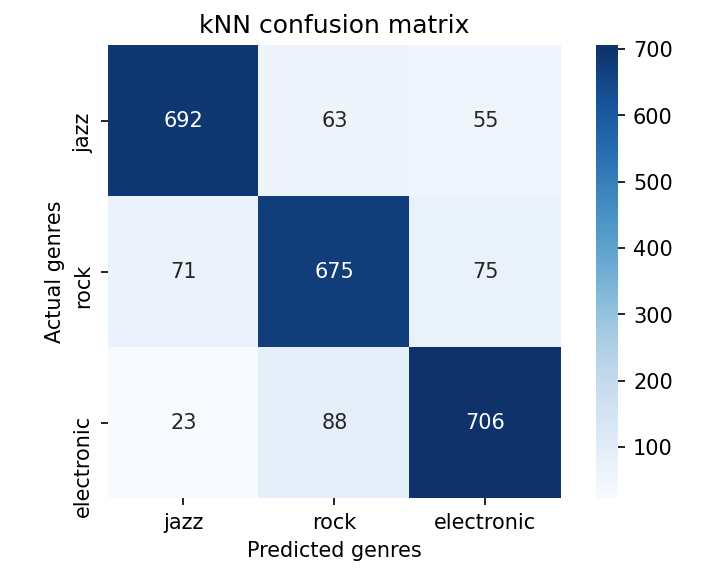
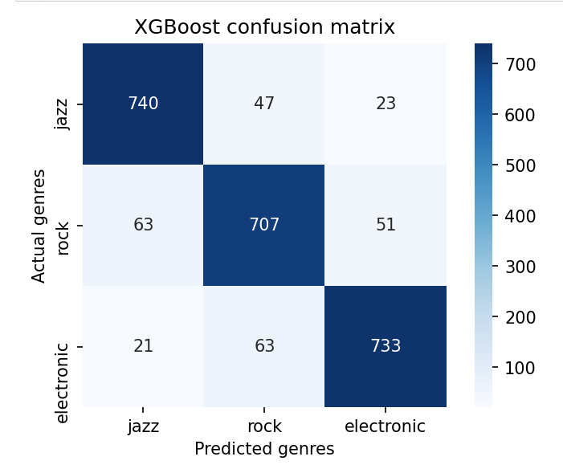

After I grabbed a total of 10,000 tracks from Spotify with my dataset, evenly split between Rock and Jazz tracks, data cleaning/EDA was relatively painless for me as I told my API function to drop any tracks that had null values and all of my features were numerical values aside from Track Name, Artist, and Album. Those three categorial features were not used in my model.

I ran my data through 3 different binary classification models: KNN, LogisticClassificationCV, and Random Forest. Random forest gave me the best results with a validation set accuracy score of 0.92 and log loss score of 0.23. For my specific classification project, accuracy seems to be the best metric to judge my dataset on as one target label is not more ideal than another -- one label is not better than another as my classification problem pertains to whether or not I can accurately predict all genres, therefore precision/recall/F1 might not be as relevant to me. Log loss could be an important secondary metric to see my model's confidence in predicting genres. 

Since my model seems to be running relatively high metrics, I decided to move onto multiclass classification. I grabbed an additional 5,000 tracks under the Electronic genre and ran my dataset through KNN, LogisticClassificationCV, Random Forest, and XGBoost. KNN gave me the lowest accuracy score of 0.85 while XGBoost gave me the highest accuracy score of 0.89. 

It seems that XGBoost is my best performing model for my multiclass genre classification. My next steps will be to see if I can raise the accuracy score and to incorporate a few more genres into my model to see how it performs. 
